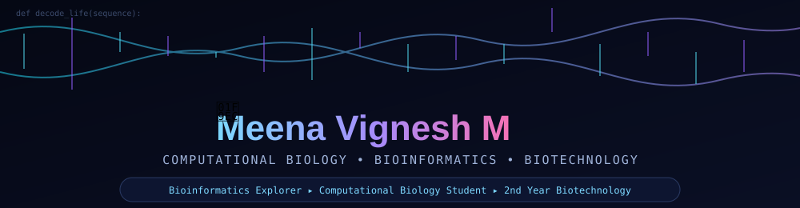

<div align="center">
  
</div>

<div align="center">

## 🧬 BIOINFORMATICS • COMPUTATIONAL BIOLOGY • AI FOR LIFE SCIENCE

### **Meena Vignesh M**
**B.Tech Biotechnology Undergraduate | Bioinformatics & Computational Biology**

<a href="https://github.com/meenavignesh-svg"></a>
<a href="https://www.linkedin.com/in/meena-vignesh-m-310664380/"></a>
<a href="mailto:meenavignesh6789@gmail.com"></a>
<a href="https://github.com/meenavignesh-svg?tab=repositories"></a>


</div>

---

## 👨‍🔬 Profile

I am a **Biotechnology undergraduate building a foundation in bioinformatics and computational biology**, with a growing focus on using computation and artificial intelligence to investigate biological systems.

My work sits at the intersection of:

**Biology → Biological Data → Computation → AI/ML → Scientific Insight**

I am particularly interested in turning biological questions into **reproducible analyses, computational tools and research-oriented software**.

### 🎓 Academic Focus

- **Degree:** B.Tech Biotechnology
- **Current stage:** Undergraduate — 2nd Year
- **Primary direction:** Bioinformatics & Computational Biology
- **Secondary interests:** AI/ML for Biology, Genomics, Microbial Biotechnology and Environmental Biotechnology

---

## 🔬 Bioinformatics Focus

| Domain | What I'm Exploring |
|---|---|
| 🧬 **Sequence Analysis** | DNA/RNA/protein sequences and computational analysis |
| 🧬 **Genomics** | Genomic data, biological variation and analysis workflows |
| 🧪 **Transcriptomics** | Gene-expression data and computational interpretation |
| 🧫 **Microbial Informatics** | Microbial systems and biotechnology applications |
| 🧬 **Protein Bioinformatics** | Protein sequences, structure and functional analysis |
| 🤖 **AI for Biology** | Machine learning and intelligent biological workflows |
| 📊 **Scientific Data Science** | Processing, visualization and interpretation of biological datasets |
| 🔁 **Reproducible Research** | Version control, automation and computational workflows |

---

## 🧪 Selected Projects

<div align="center">

### 🛡️ BioSentinel AI
**AI-assisted biotechnology risk detection and monitoring concept.**

<a href="https://github.com/meenavignesh-svg/biosentinel_ai"></a>

### 🧬 AEGIS-BIO-NODE
**Computational biotechnology experimentation and biological data workflows.**

<a href="https://github.com/meenavignesh-svg/AEGIS-BIO-NODE"></a>

### 🧠 HELIX MINDBIO AI
**Exploring AI-assisted biological analysis and computational life-science applications.**

<a href="https://github.com/meenavignesh-svg/HELIX_MINDBIO_AI"></a>

### 🧪 Rosalind Complete Suite
**Computational problem solving for bioinformatics and biological sequence analysis.**

<a href="https://github.com/meenavignesh-svg/rosalind-complete-suite"></a>

### 🤖 JARVIS AI Assistant
**AI and software engineering experimentation.**

<a href="https://github.com/meenavignesh-svg/jarvis-ai-assistant"></a>

### 🧬 MARGOTS
**Experimental AI/software project under active development.**

<a href="https://github.com/meenavignesh-svg/margots"></a>

</div>

<a href="https://github.com/meenavignesh-svg?tab=repositories"></a>

---

## 🧰 Computational Toolkit

<div align="center">


</div>

### 🔬 Scientific Computing Mindset

```text
Biological Question
        ↓
Data Acquisition / Dataset
        ↓
Quality Control & Pre-processing
        ↓
Computational Analysis
        ↓
Statistical / AI Interpretation
        ↓
Biological Insight
        ↓
Reproducible Result
```

---

## 🧬 Current Learning Direction

- Bioinformatics algorithms and biological sequence analysis
- Genomics and transcriptomics
- Protein bioinformatics
- Python/R for biological data analysis
- Machine learning for life-science datasets
- Linux-based computational workflows
- Git/GitHub and reproducible research practices
- Scientific visualization and data interpretation

---

## 📊 GitHub Activity

<div align="center">


</div>

---

## 🤝 Research & Collaboration

I am open to learning and collaborating on projects involving:

**Bioinformatics · Computational Biology · Genomics · Protein Informatics · AI for Biology · Microbial Biotechnology · Environmental Biotechnology · Scientific Software**

<div align="center">

<a href="https://github.com/meenavignesh-svg?tab=repositories"></a>
<a href="https://www.linkedin.com/in/meena-vignesh-m-310664380/"></a>
<a href="mailto:meenavignesh6789@gmail.com"></a>

</div>

---

<div align="center">

### 🧬 From biological data to computational insight.

**Learn • Analyze • Build • Reproduce • Improve**

</div>
